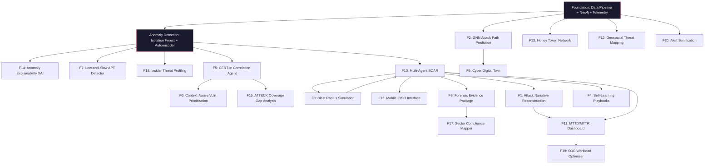

# Implementation Plan: Rakshak.AI - Cyber Resilience Platform for Critical National Infrastructure

> Reference: All 20 features from [cyber_feature_list.md](file:///Users/AayushShukla/.gemini/antigravity/brain/d779c6cf-3c07-4906-88ad-45aa6fb042ca/cyber_feature_list.md)

---

## Table of Contents
1. [User Review Required](#user-review-required)
2. [Open Questions](#open-questions)
3. [Tech Stack & Versions](#tech-stack--versions)
4. [Environment Setup](#environment-setup)
5. [Data Sources & Acquisition](#data-sources--acquisition)
6. [Project Directory Layout](#project-directory-layout)
7. [Database Schemas](#database-schemas)
8. [API Endpoint Specification](#api-endpoint-specification)
9. [Feature Dependency Graph](#feature-dependency-graph)
10. [Feature Implementation Specs (All 20)](#feature-implementation-specs-all-20)
11. [Frontend Wireframe Descriptions](#frontend-wireframe-descriptions)
12. [Week-by-Week Timeline (20 Weeks)](#week-by-week-timeline-20-weeks)
13. [Risk Register & Mitigations](#risk-register--mitigations)
14. [Verification Plan](#verification-plan)

---

## User Review Required

> [!IMPORTANT]
> **LLM Provider Choice:** Features #1, #3, #4, #5, #10 require LLM reasoning. We need to decide between OpenAI (GPT-4o), Anthropic (Claude 3.5 Sonnet), or Google (Gemini 1.5 Pro). Recommendation: Use **OpenAI GPT-4o** for primary reasoning (best function-calling support for LangGraph agents) and keep Claude as fallback. Estimated API cost during development: ~$50-100/month.

> [!WARNING]
> **Neo4j Deployment:** Neo4j Community Edition is free but limited to a single database. For our use case (network topology + service dependencies + honeypot registry all in one graph), single-database is sufficient. If we need multiple isolated graphs (e.g., for Digital Twin sandboxing in Feature #9), we'll need Neo4j AuraDB free tier or Docker-based isolation.

> [!IMPORTANT]
> **Hardware:** PyTorch Geometric (for Feature #2 GNN) requires compilation against your local CUDA/CPU architecture. On Apple Silicon Macs, use `pip install torch-geometric` with the CPU-only PyTorch build. Training the GNN on our small graph (~50-100 nodes) is fast on CPU — no GPU required.

---

## Open Questions

> [!NOTE]
> 1. **CERT-In Feed:** CERT-In has no public API. **Recommendation:** Manually curate 50-100 recent advisories from https://www.cert-in.org.in/ as HTML files, convert to plain text, and pre-embed in ChromaDB. This guarantees demo stability.
>
> 2. **Dataset Selection:** LANL has the best behavioral data (58 days, includes red-team). UNSW-NB15 has the best attack-type diversity (9 attack categories). **Recommendation:** Use LANL as primary dataset for Features #7 (Low-and-Slow) and #18 (Insider Threat). Use UNSW-NB15 for Features #1 (Narrative), #10 (SOAR), and #14 (XAI) because its labeled attack types make MITRE mapping easier.
>
> 3. **Frontend Framework:** Next.js (React) vs plain Vite+React? **Recommendation:** Use **Vite + React** — we don't need SSR/SSG, and Vite is faster for prototyping. The frontend is a single-page dashboard app, not a content site.

---

## Tech Stack & Versions

### Backend
| Component | Technology | Version | Purpose |
|---|---|---|---|
| Runtime | Python | 3.11+ | Primary backend language |
| API Framework | FastAPI | 0.115+ | REST + WebSocket endpoints |
| WebSockets | `websockets` | 13.0+ | Real-time telemetry streaming |
| Graph Database | Neo4j | 5.x (Community) | Network topology, attack paths, blast radius |
| Neo4j Driver | `neo4j` (Python) | 5.x | Cypher query execution |
| Vector Database | ChromaDB | 0.5+ | CERT-In advisories, MITRE ATT&CK embeddings |
| Embeddings | `sentence-transformers` | 3.x | `all-MiniLM-L6-v2` for vector embeddings |
| Anomaly Detection | PyOD | 2.0+ | Isolation Forest, Autoencoder |
| GNN | PyTorch Geometric | 2.5+ | Graph Neural Network for attack path prediction |
| Graph Analytics | NetworkX | 3.3+ | Betweenness centrality, shortest path, PageRank |
| Change-Point Detection | `ruptures` | 1.1+ | CUSUM, Bayesian Online CPD for Feature #7 |
| Explainability | `shap` | 0.45+ | SHAP values for Isolation Forest |
| LLM Orchestration | LangGraph | 0.2+ | Multi-agent SOAR orchestration |
| LLM Client | `openai` | 1.x | GPT-4o API calls |
| PDF Generation | `weasyprint` | 62+ | Forensic evidence package PDFs |
| Hashing | `hashlib` (stdlib) | — | SHA-256 for evidence chain of custody |
| Task Queue | `asyncio` | stdlib | Async telemetry replay and agent execution |
| Testing | `pytest` + `pytest-asyncio` | 8.x | Unit and integration tests |

### Frontend
| Component | Technology | Version | Purpose |
|---|---|---|---|
| Build Tool | Vite | 6.x | Fast development builds |
| UI Framework | React | 19.x | Component-based UI |
| Styling | Tailwind CSS | 4.x | Utility-first CSS |
| Network Graph | Cytoscape.js | 3.30+ | Interactive network topology visualization |
| 3D Globe | Globe.gl | 2.x | Geospatial threat origin mapping |
| Charts | Recharts | 2.x | MTTD/MTTR metrics, SHAP bar charts |
| Timeline | `react-chrono` | 2.x | Attack narrative timeline |
| Markdown | `react-markdown` | 9.x | Rendering LLM narrative output |
| WebSocket Client | Native `WebSocket` API | — | Real-time telemetry and alert streaming |
| Audio | Web Audio API | Native | Alert sonification |
| Icons | Lucide React | 0.4+ | Security-themed iconography |

### Infrastructure
| Component | Technology | Purpose |
|---|---|---|
| Containerization | Docker + Docker Compose | Local multi-service orchestration |
| Neo4j | Docker image `neo4j:5-community` | Graph database container |
| Reverse Proxy | Nginx (optional) | Serve frontend + proxy API in production demo |

---

## Environment Setup

### Prerequisites
```bash
# Required software
- Python 3.11+
- Node.js 20+ & npm
- Docker Desktop (for Neo4j)
- Git
```

### Step-by-Step Setup
```bash
# 1. Create project directory
mkdir -p /Users/AayushShukla/.gemini/antigravity/scratch/cni-resilience
cd /Users/AayushShukla/.gemini/antigravity/scratch/cni-resilience

# 2. Start Neo4j via Docker
docker run -d \
  --name cni-neo4j \
  -p 7474:7474 -p 7687:7687 \
  -e NEO4J_AUTH=neo4j/cnipassword123 \
  -e NEO4J_PLUGINS='["apoc"]' \
  -v neo4j_data:/data \
  neo4j:5-community

# 3. Create Python virtual environment
python3 -m venv .venv
source .venv/bin/activate

# 4. Install Python dependencies
pip install fastapi uvicorn websockets neo4j chromadb sentence-transformers \
  pyod torch torch-geometric networkx ruptures shap langgraph openai \
  weasyprint pandas numpy scikit-learn pytest pytest-asyncio httpx

# 5. Initialize frontend
cd frontend
npm create vite@latest . -- --template react
npm install cytoscape react-cytoscapejs globe.gl recharts react-chrono \
  react-markdown tailwindcss @tailwindcss/vite lucide-react
```

---

## Data Sources & Acquisition

### 1. LANL Unified Host and Network Dataset
- **URL:** https://csr.lanl.gov/data/cyber1/
- **What it contains:** 58 consecutive days of anonymized network event data from Los Alamos National Laboratory. Includes authentication logs (`auth.txt.gz`, ~1.6B events), process events, network flows, and DNS queries. Contains embedded red-team (attacker) events with ground-truth labels in `redteam.txt.gz`.
- **Size:** ~12 GB compressed, ~130 GB uncompressed
- **What we use:** `auth.txt.gz` (authentication events — who logged into what, when) and `redteam.txt.gz` (ground truth attack labels). We will sample 1-2 million rows for development and use the red-team labels to validate our anomaly detection.
- **Schema:** `time,user@domain,source_computer,destination_computer,auth_type,logon_type,auth_orientation,success/failure`
- **Features it powers:** #7 (Low-and-Slow), #14 (XAI), #18 (Insider Threat)

### 2. UNSW-NB15 Dataset
- **URL:** https://research.unsw.edu.au/projects/unsw-nb15-dataset
- **What it contains:** ~2.5 million records of normal and attack traffic across 9 categories: Fuzzers, Analysis, Backdoors, DoS, Exploits, Generic, Reconnaissance, Shellcode, Worms. Each record has 49 features including flow duration, packet sizes, and protocol types.
- **Size:** ~1.8 GB (4 CSV files)
- **What we use:** All 4 CSV files. The labeled `attack_cat` column maps directly to MITRE ATT&CK techniques, making it ideal for training the anomaly detector and validating MITRE correlations.
- **Features it powers:** #1 (Narrative), #2 (GNN training data), #10 (SOAR testing), #11 (MTTD/MTTR benchmarking)

### 3. MITRE ATT&CK Enterprise Matrix (STIX/TAXII)
- **URL:** https://github.com/mitre/cti (STIX 2.1 JSON bundles)
- **What it contains:** Complete machine-readable database of all ATT&CK techniques, tactics, procedures, and threat groups. 201 techniques in the Enterprise matrix.
- **What we use:** `enterprise-attack.json` — parsed to populate the vector store and to power Features #1 (technique citations), #5 (correlation), #15 (gap analysis).
- **Format:** STIX 2.1 JSON. Each technique has: `id`, `name`, `description`, `kill_chain_phases`, `x_mitre_detection`.

### 4. CERT-In Advisories
- **URL:** https://www.cert-in.org.in/
- **What it contains:** Indian Computer Emergency Response Team advisories covering vulnerabilities, threat campaigns, and security best practices specific to Indian infrastructure.
- **What we use:** Manually curate 50-100 recent advisories (2024-2026). Save as text files in `data/cert_in/`. Embed into ChromaDB using `all-MiniLM-L6-v2`.
- **Features it powers:** #5 (CERT-In Correlation), #6 (Vuln Prioritization), #15 (Gap Analysis), #17 (Compliance)

### 5. NVD (National Vulnerability Database)
- **URL:** https://services.nvd.nist.gov/rest/json/cves/2.0
- **What it contains:** Every CVE (Common Vulnerabilities and Exposures) with CVSS scores, descriptions, and affected products.
- **What we use:** REST API queries to fetch CVE details for assets in our mock network. Cache results in a local JSON file for demo stability.
- **Features it powers:** #6 (Context-Aware Vulnerability Prioritization)

### 6. MaxMind GeoLite2
- **URL:** https://dev.maxmind.com/geoip/geolite2-free-geolocation-data
- **What it contains:** IP-to-country/city geolocation database.
- **What we use:** Map attacker IPs from UNSW-NB15 to geographic coordinates for the 3D globe visualization.
- **Features it powers:** #12 (Geospatial Threat Mapping)

---

## Project Directory Layout

```text
cni-resilience/
├── README.md
├── docker-compose.yml              # Neo4j + optional services
├── .env                            # API keys, Neo4j credentials
│
├── data/
│   ├── lanl/
│   │   ├── auth_sample.csv         # Sampled 1-2M rows from auth.txt.gz
│   │   └── redteam.txt             # Ground-truth attack labels
│   ├── unsw_nb15/
│   │   ├── UNSW-NB15_1.csv
│   │   ├── UNSW-NB15_2.csv
│   │   ├── UNSW-NB15_3.csv
│   │   └── UNSW-NB15_4.csv
│   ├── mitre/
│   │   └── enterprise-attack.json  # STIX 2.1 ATT&CK matrix
│   ├── cert_in/
│   │   ├── CIAD-2025-001.txt       # Curated advisory text files
│   │   ├── CIAD-2025-002.txt
│   │   └── ... (50-100 files)
│   ├── nvd/
│   │   └── cve_cache.json          # Cached NVD API responses
│   └── geoip/
│       └── GeoLite2-City.mmdb      # MaxMind database file
│
├── backend/
│   ├── run.py                      # `uvicorn app.main:app --reload`
│   ├── requirements.txt
│   ├── tests/
│   │   ├── test_telemetry.py
│   │   ├── test_anomaly.py
│   │   ├── test_gnn.py
│   │   ├── test_soar.py
│   │   ├── test_threat_intel.py
│   │   └── test_reporting.py
│   └── app/
│       ├── __init__.py
│       ├── main.py                 # FastAPI app factory, CORS, WebSocket routes
│       ├── config.py               # Pydantic Settings (env vars)
│       ├── models/
│       │   ├── schemas.py          # Pydantic models for all API request/response shapes
│       │   └── enums.py            # Severity levels, agent states, playbook statuses
│       ├── database/
│       │   ├── neo4j_client.py     # Connection pool, Cypher query helpers
│       │   ├── neo4j_seed.py       # Seeds the mock network topology on startup
│       │   ├── vector_store.py     # ChromaDB collections: mitre, certin, nvd
│       │   └── vector_seed.py      # Embeds MITRE/CERT-In docs on first run
│       ├── telemetry/
│       │   ├── replayer.py         # Async CSV→WebSocket streamer with speed control
│       │   ├── parser.py           # Normalizes LANL/UNSW schemas to unified format
│       │   └── buffer.py           # Sliding window buffer for behavioral analysis
│       ├── anomaly_engine/
│       │   ├── detector.py         # Isolation Forest + Autoencoder pipeline
│       │   ├── gnn_model.py        # PyTorch Geometric GCN for attack path prediction
│       │   ├── gnn_trainer.py      # Training script for the GNN
│       │   ├── low_slow.py         # CUSUM + Bayesian change-point detection
│       │   ├── explainability.py   # SHAP value extraction per anomaly
│       │   └── insider.py          # User behavioral clustering for insider threats
│       ├── threat_intel/
│       │   ├── mitre_mapper.py     # Maps anomaly features → MITRE technique IDs
│       │   ├── correlation.py      # RAG agent: anomaly → CERT-In advisory match
│       │   ├── vuln_context.py     # CVE re-scoring with topology context
│       │   └── gap_analysis.py     # ATT&CK coverage matrix computation
│       ├── soar/
│       │   ├── orchestrator.py     # LangGraph StateGraph definition
│       │   ├── agents/
│       │   │   ├── triage.py       # Severity classification agent
│       │   │   ├── containment.py  # Isolation & credential revocation agent
│       │   │   ├── evidence.py     # Log preservation & hashing agent
│       │   │   ├── communication.py# Stakeholder notification drafting agent
│       │   │   └── escalation.py   # Human gate agent (blast radius check)
│       │   ├── playbooks/
│       │   │   ├── credential_theft.json
│       │   │   ├── lateral_movement.json
│       │   │   ├── data_exfiltration.json
│       │   │   └── ransomware.json
│       │   ├── playbook_evolver.py  # LLM-based playbook improvement proposer
│       │   ├── blast_radius.py      # Neo4j dependency traversal + impact scoring
│       │   └── honeypots.py         # Honey token registry & trigger detection
│       └── reporting/
│           ├── narrator.py          # LLM attack narrative generator
│           ├── forensics.py         # PDF evidence package builder
│           ├── compliance.py        # Regulatory mapping (IT Act, DPDPA, CERT-In)
│           ├── metrics.py           # MTTD/MTTR/FPR calculator
│           └── workload.py          # SOC analyst ticket analytics
│
├── frontend/
│   ├── package.json
│   ├── vite.config.js
│   ├── index.html
│   ├── public/
│   │   └── favicon.svg
│   └── src/
│       ├── main.jsx
│       ├── App.jsx                  # React Router: Dashboard | Twin | Reports | Vulns
│       ├── styles/
│       │   └── index.css            # Tailwind imports + custom dark theme tokens
│       ├── hooks/
│       │   ├── useWebSocket.js      # Custom hook for telemetry/alert streams
│       │   └── useAudio.js          # Custom hook for sonification engine
│       ├── pages/
│       │   ├── Dashboard.jsx        # Main CISO view: metrics, alert feed, SOC stats
│       │   ├── NetworkTwin.jsx      # Cytoscape graph + attack simulation controls
│       │   ├── IncidentReports.jsx  # Narrative timeline + PDF download
│       │   ├── Vulnerabilities.jsx  # Context-scored CVE table + gap analysis
│       │   └── Playbooks.jsx        # Playbook version history + evolution proposals
│       ├── components/
│       │   ├── NetworkGraph.jsx     # Cytoscape.js wrapper with real-time updates
│       │   ├── ThreatGlobe.jsx      # Globe.gl 3D attack origin visualization
│       │   ├── NarrativeTimeline.jsx # react-chrono based incident story
│       │   ├── BlastRadiusModal.jsx  # Impact assessment popup before containment
│       │   ├── EscalationPanel.jsx   # Mobile-responsive CISO approval interface
│       │   ├── ShapChart.jsx         # SHAP waterfall chart per anomaly
│       │   ├── MetricsCards.jsx      # MTTD/MTTR/FPR stat cards
│       │   ├── AlertFeed.jsx         # Real-time scrolling alert log
│       │   ├── MitreHeatmap.jsx      # ATT&CK matrix heatmap (coverage gaps)
│       │   ├── ComplianceBadges.jsx   # Regulatory status indicators
│       │   └── SonificationToggle.jsx # Audio on/off + volume control
│       └── utils/
│           ├── api.js                # Axios/fetch wrappers for all backend endpoints
│           ├── audio.js              # Web Audio API sonification engine
│           └── constants.js          # Severity colors, MITRE tactic names, etc.
```

---

## Database Schemas

### Neo4j Graph Schema

#### Node Types

**(:Host)**
```
{
  id: STRING (unique),           // "srv-dc-01"
  ip: STRING,                    // "10.0.1.10"
  hostname: STRING,              // "DomainController"
  type: ENUM,                    // "server" | "workstation" | "firewall" | "vpn_gateway"
  os: STRING,                    // "Windows Server 2019"
  zone: STRING,                  // "dmz" | "internal" | "management" | "internet"
  sensitivity: ENUM,             // "critical" | "high" | "medium" | "low"
  cve_list: LIST<STRING>,        // ["CVE-2024-21762", "CVE-2024-3400"]
  is_honeypot: BOOLEAN,          // Feature #13
  status: ENUM                   // "active" | "isolated" | "compromised"
}
```

**(:User)**
```
{
  id: STRING,                    // "user_rajesh_kumar"
  username: STRING,              // "rajesh.kumar"
  department: STRING,            // "Finance"
  role: STRING,                  // "analyst" | "admin" | "contractor"
  risk_score: FLOAT,             // 0.0 - 1.0 (Feature #18 insider threat)
  is_honeypot: BOOLEAN           // Feature #13: fake "backup_admin" account
}
```

**(:Service)**
```
{
  id: STRING,                    // "svc-payroll"
  name: STRING,                  // "Payroll Processing"
  criticality: ENUM,             // "critical" | "high" | "medium" | "low"
  active_users: INTEGER,         // 2400
  financial_value: FLOAT,        // 42000000 (₹4.2 crore in pending transactions)
  sla_hours: INTEGER             // 6 (deadline pressure)
}
```

**(:Incident)**
```
{
  id: STRING,                    // "INC-2026-0047"
  status: ENUM,                  // "active" | "contained" | "resolved"
  severity: ENUM,                // "critical" | "high" | "medium" | "low"
  detected_at: DATETIME,
  contained_at: DATETIME,
  playbook_used: STRING,         // "lateral_movement.json"
  narrative: TEXT,               // LLM-generated story (Feature #1)
  mitre_techniques: LIST<STRING> // ["T1566", "T1078", "T1550.002"]
}
```

**(:Playbook)**
```
{
  id: STRING,                    // "pb-lateral-movement-v3"
  name: STRING,                  // "Credential Theft + Lateral Movement"
  version: INTEGER,              // 3
  status: ENUM,                  // "active" | "proposed" | "archived"
  steps: JSON_STRING,            // Serialized playbook steps
  avg_containment_time: FLOAT,   // 252.0 (seconds)
  proposed_diff: JSON_STRING     // Feature #4: pending improvement
}
```

#### Relationship Types

| Relationship | From | To | Properties |
|---|---|---|---|
| `(:Host)-[:CONNECTS_TO]->(:Host)` | Any host | Any host | `{port: 443, protocol: "TCP", firewall_rule: "allow", segmented: false}` |
| `(:User)-[:AUTHENTICATES_TO]->(:Host)` | User | Host | `{last_login: DATETIME, frequency: "daily", avg_session_minutes: 22}` |
| `(:Host)-[:RUNS]->(:Service)` | Host | Service | `{port: 8080, process: "java"}` |
| `(:Service)-[:DEPENDS_ON]->(:Service)` | Service | Service | `{dependency_type: "database", critical: true}` |
| `(:Incident)-[:COMPROMISED]->(:Host)` | Incident | Host | `{timestamp: DATETIME, technique: "T1078"}` |
| `(:Incident)-[:USED_PLAYBOOK]->(:Playbook)` | Incident | Playbook | `{outcome: "contained", duration_seconds: 252}` |

#### Mock Network Topology (Seeded on Startup)

```
Internet Gateway (firewall)
├── DMZ
│   ├── Web Server (10.0.0.10)
│   └── VPN Gateway (10.0.0.20)
├── Internal Zone
│   ├── Domain Controller (10.0.1.10) [CRITICAL]
│   ├── Email Server (10.0.1.20)
│   ├── Finance Database (10.0.1.30) [CRITICAL]
│   ├── HR Application (10.0.1.40)
│   └── File Server (10.0.1.50) [contains honeypot share]
├── OT Zone (Air-gapped)
│   ├── SCADA Controller (10.0.2.10) [CRITICAL]
│   └── PLC Gateway (10.0.2.20)
├── User Workstations (10.0.3.x)
│   ├── 20 regular workstations
│   └── 3 admin workstations
└── Management Zone
    ├── Backup Server (10.0.4.10)
    └── Monitoring Server (10.0.4.20)
```

### ChromaDB Vector Store Collections

| Collection | Content | Embedding Model | Document Count |
|---|---|---|---|
| `mitre_attack` | MITRE ATT&CK technique descriptions | `all-MiniLM-L6-v2` | ~201 documents |
| `cert_in_advisories` | Curated CERT-In advisory text | `all-MiniLM-L6-v2` | 50-100 documents |
| `nvd_cves` | CVE descriptions for mock network assets | `all-MiniLM-L6-v2` | ~50 documents |

---

## API Endpoint Specification

### Telemetry & Streaming
| Method | Endpoint | Description | Feature |
|---|---|---|---|
| `WS` | `/api/v1/telemetry/stream` | WebSocket: streams parsed log events in real-time | Foundation |
| `POST` | `/api/v1/telemetry/replay/start` | Start replaying a dataset (LANL or UNSW) at configurable speed | Foundation |
| `POST` | `/api/v1/telemetry/replay/stop` | Stop the active replay | Foundation |
| `GET` | `/api/v1/telemetry/replay/status` | Current replay position, events processed, speed | Foundation |

### Anomaly Detection
| Method | Endpoint | Description | Feature |
|---|---|---|---|
| `WS` | `/api/v1/anomalies/stream` | WebSocket: streams anomaly alerts as they're detected | #14 |
| `GET` | `/api/v1/anomalies/{anomaly_id}` | Get full anomaly details + SHAP explanation | #14 |
| `GET` | `/api/v1/anomalies/{anomaly_id}/shap` | SHAP feature contributions for this anomaly | #14 |
| `GET` | `/api/v1/anomalies/low-slow` | List all low-and-slow behavioral change alerts | #7 |
| `GET` | `/api/v1/anomalies/insider-threats` | List insider threat risk profiles | #18 |

### Attack Path & Graph
| Method | Endpoint | Description | Feature |
|---|---|---|---|
| `GET` | `/api/v1/topology` | Full network graph (nodes + edges) for visualization | Foundation |
| `GET` | `/api/v1/topology/host/{host_id}` | Single host details + connections + CVEs | #6 |
| `POST` | `/api/v1/attack-path/predict` | Given compromised host, predict next targets | #2 |
| `POST` | `/api/v1/digital-twin/simulate` | Run a what-if attack scenario from a starting node | #9 |

### Threat Intelligence
| Method | Endpoint | Description | Feature |
|---|---|---|---|
| `POST` | `/api/v1/threat-intel/correlate` | Correlate an anomaly against CERT-In + MITRE | #5 |
| `GET` | `/api/v1/threat-intel/mitre-coverage` | ATT&CK coverage heatmap data | #15 |
| `GET` | `/api/v1/vulnerabilities` | List all CVEs with contextualized scores | #6 |
| `GET` | `/api/v1/vulnerabilities/{cve_id}` | Single CVE with topology context explanation | #6 |

### SOAR & Incident Response
| Method | Endpoint | Description | Feature |
|---|---|---|---|
| `POST` | `/api/v1/incidents` | Create a new incident (triggered by anomaly engine) | #10 |
| `GET` | `/api/v1/incidents/{incident_id}` | Get incident details, timeline, assigned agents | #10 |
| `POST` | `/api/v1/incidents/{incident_id}/contain` | Trigger containment (with blast radius check) | #3, #10 |
| `GET` | `/api/v1/incidents/{incident_id}/blast-radius` | Get blast radius assessment for proposed action | #3 |
| `POST` | `/api/v1/incidents/{incident_id}/escalate/approve` | CISO approves escalated containment | #10, #16 |
| `POST` | `/api/v1/incidents/{incident_id}/escalate/reject` | CISO rejects, provides alternative | #10, #16 |
| `GET` | `/api/v1/incidents/{incident_id}/narrative` | Get LLM-generated attack narrative | #1 |
| `GET` | `/api/v1/honeypots/alerts` | List all honey token trigger events | #13 |

### Reporting & Forensics
| Method | Endpoint | Description | Feature |
|---|---|---|---|
| `GET` | `/api/v1/incidents/{incident_id}/forensic-report` | Download PDF forensic evidence package | #8 |
| `GET` | `/api/v1/incidents/{incident_id}/compliance` | Regulatory compliance checklist for this incident | #17 |
| `GET` | `/api/v1/metrics` | MTTD, MTTR, FPR, playbook coverage stats | #11 |
| `GET` | `/api/v1/metrics/workload` | SOC analyst workload distribution | #19 |

### Playbook Management
| Method | Endpoint | Description | Feature |
|---|---|---|---|
| `GET` | `/api/v1/playbooks` | List all playbooks with versions | #4 |
| `GET` | `/api/v1/playbooks/{playbook_id}/proposed-changes` | Get AI-proposed playbook improvements | #4 |
| `POST` | `/api/v1/playbooks/{playbook_id}/approve-changes` | Merge proposed playbook update | #4 |

---

## Feature Dependency Graph

Features are not independent. This dependency graph determines build order:



**Critical Path:** Foundation → Anomaly Detection → SOAR (#10) → Blast Radius (#3) → Narrative (#1) → Forensics (#8)

---

## Feature Implementation Specs (All 20)

### Foundation Layer (Not a numbered feature — prerequisite for everything)

#### Telemetry Replay Engine (`telemetry/replayer.py`)
```python
# Core logic:
# 1. Load CSV dataset into pandas DataFrame
# 2. Sort by timestamp column
# 3. Calculate time deltas between consecutive events
# 4. Async loop: for each row, sleep(delta * speed_factor), then emit via WebSocket
# 5. Speed factor: 1.0 = real-time, 100.0 = 100x speed, 0.0 = as fast as possible

# Configurable parameters:
#   - dataset: "lanl" | "unsw"
#   - speed_factor: float (default 100.0 for demos)
#   - attack_only: bool (if True, only replay attack-labeled rows for faster testing)
```

#### Telemetry Parser (`telemetry/parser.py`)
```python
# Unified telemetry schema (output of parser):
{
    "event_id": "uuid4",
    "timestamp": "2026-07-04T03:14:22Z",
    "source_ip": "10.0.3.15",
    "destination_ip": "10.0.1.30",
    "source_user": "rajesh.kumar",
    "destination_host": "FinanceDB",
    "port": 1433,
    "protocol": "TCP",
    "bytes_sent": 2300000000,      # 2.3 GB
    "bytes_received": 1024,
    "command": "SELECT * FROM transactions",
    "auth_result": "success",
    "dataset_label": "Exfiltration",  # ground truth (if available)
    "mitre_technique": "T1041"        # mapped by mitre_mapper.py
}
```

#### Neo4j Seed Script (`database/neo4j_seed.py`)
Seeds the full mock network topology (~40 hosts, ~15 users, ~8 services, ~60 CONNECTS_TO relationships) described in the schema section above. Runs automatically on first startup.

---

### Feature #1: Natural Language Attack Narrative Reconstruction (Composite: 9.30)

**Backend Module:** `reporting/narrator.py`

**Algorithm:**
1. Query all anomalous events for a given `incident_id`, ordered by timestamp
2. For each event, look up the MITRE technique via `mitre_mapper.py`
3. Construct a structured prompt:

```
System: You are a cybersecurity incident narrator. Given the following 
chronological sequence of security events, reconstruct the attack as a 
coherent narrative story. For each step, cite the MITRE ATT&CK technique 
ID and name. Include timestamps, affected systems, and data volumes. 
End with a summary of total dwell time and data impact.

Events:
| # | Timestamp | Source | Destination | Action | Bytes | MITRE |
|---|-----------|--------|-------------|--------|-------|-------|
| 1 | 02:14 AM  | External | rajesh.kumar | Phishing email opened | 0 | T1566 |
| 2 | 02:31 AM  | rajesh.kumar | DomainController | Authentication | 0 | T1078 |
...
```

4. Stream LLM response to frontend via Server-Sent Events (SSE) for real-time typing effect
5. Cache the final narrative in the `:Incident` node's `narrative` property

**Frontend:** `NarrativeTimeline.jsx` renders each paragraph as a card in a vertical timeline using `react-chrono`. Each card shows the timestamp, a brief description, the MITRE technique badge, and a small network diagram snippet.

---

### Feature #2: GNN Attack Path Prediction (Composite: 9.10)

**Backend Modules:** `anomaly_engine/gnn_model.py`, `anomaly_engine/gnn_trainer.py`

**Algorithm:**
1. Extract network graph from Neo4j as adjacency matrix + node feature matrix
2. Node features (per host): `[is_internet_facing, num_open_ports, num_cves, sensitivity_score, has_firewall, zone_encoding]`
3. Edge features: `[has_firewall_rule, is_segmented, port_count]`
4. **Model Architecture:**
   ```
   Input → GCNConv(in=6, out=32) → ReLU → GCNConv(32, 16) → ReLU → 
   Link Prediction Head (dot product of node embeddings) → Sigmoid → Probability
   ```
5. **Training:** Use MITRE ATT&CK lateral movement documentation to generate positive training edges (attacker moved from A to B) and random negative edges. Train for 100 epochs.
6. **Inference:** Given a compromised node, compute link prediction scores to all reachable nodes. Return top-3 with probabilities.
7. **Automated Hardening:** For each predicted target, call `soar/containment.py` to:
   - Increase monitoring sensitivity on the predicted target
   - Add temporary firewall tightening rules in the Neo4j graph
   - Flag for MFA re-verification

**Frontend:** `NetworkGraph.jsx` draws animated dashed red arrows from the compromised node to the top-3 predicted targets. Each arrow has a probability label. Predicted targets get a pulsing red border.

---

### Feature #3: Blast Radius Simulation (Composite: 8.95)

**Backend Module:** `soar/blast_radius.py`

**Algorithm:**
1. Input: `host_id` of the node to potentially isolate
2. Cypher query:
   ```cypher
   MATCH (h:Host {id: $host_id})-[:RUNS]->(s:Service)
   OPTIONAL MATCH (s)<-[:DEPENDS_ON*1..3]-(downstream:Service)
   OPTIONAL MATCH (s)<-[:USES]-(u:User)
   RETURN s, collect(DISTINCT downstream) as affected_services, 
          count(DISTINCT u) as affected_users
   ```
3. Scoring formula:
   $$\text{BlastRadius} = \sum_{s \in \text{services}} \left( w_s \cdot c_s + \frac{f_s}{10^6} \right) + \alpha \cdot \log(U + 1)$$
   Where: $w_s$ = service weight, $c_s$ = criticality multiplier (critical=10, high=5, medium=2, low=1), $f_s$ = financial value of active transactions, $U$ = total affected users, $\alpha$ = 0.5
4. Decision logic:
   - If `BlastRadius < 15`: AUTO-ISOLATE (agent proceeds without human)
   - If `15 ≤ BlastRadius < 50`: ISOLATE WITH NOTIFICATION (proceeds, notifies CISO)
   - If `BlastRadius ≥ 50`: ESCALATE TO HUMAN (pauses, sends approval request)

**Frontend:** `BlastRadiusModal.jsx` — a dark-themed modal that slides up showing:
- Affected services as cards with criticality badges
- Financial impact bar chart
- "Risk of NOT Acting" counter showing data exfiltration rate
- Two buttons: "Approve Isolation" (green) and "Reject & Investigate" (yellow)

---

### Feature #4: Autonomous Playbook Evolution (Composite: 8.80)

**Backend Module:** `soar/playbook_evolver.py`

**Algorithm:**
1. After each incident is resolved, gather:
   - Incident timeline (events + timestamps)
   - Playbook that was executed (JSON steps)
   - Outcome metrics: containment time, data leaked, false positive count
2. LLM Prompt:
   ```
   System: You are a cybersecurity playbook optimization engineer.
   
   Incident Summary: [timeline]
   Playbook Used: [JSON]
   Outcome: Containment took 252 seconds. 340 MB exfiltrated before containment.
   
   Analyze: Was the playbook optimal? What steps could be added, removed, 
   or reordered to reduce containment time? Output a JSON diff with:
   - added_steps: [{position: int, action: string, reason: string}]
   - removed_steps: [{position: int, reason: string}]
   - reordered_steps: [{from: int, to: int, reason: string}]
   - estimated_improvement: string
   ```
3. Store the proposed diff in the `:Playbook` node's `proposed_diff` property with status `"proposed"`
4. Frontend `Playbooks.jsx` shows a diff view (old vs proposed) with an "Approve" button

---

### Feature #5: CERT-In Threat Intelligence Correlation (Composite: 8.65)

**Backend Module:** `threat_intel/correlation.py`

**Algorithm:**
1. On each HIGH or CRITICAL anomaly, extract a "signature string" combining: attack type, target port, commands used, and affected asset type
2. Query ChromaDB `cert_in_advisories` collection with the signature string
3. Retrieve top-3 matches with similarity scores
4. If top match similarity > 0.80, generate LLM correlation report:
   ```
   Given this anomaly: [signature]
   And this CERT-In advisory: [advisory text]
   
   Explain the correlation. Cite the advisory reference number.
   Recommend whether to elevate priority and notify CERT-In.
   ```
5. Return structured response with advisory ID, confidence score, and recommendation

---

### Feature #6: Context-Aware Vulnerability Prioritization (Composite: 8.40)

**Backend Module:** `threat_intel/vuln_context.py`

**Algorithm:**
1. For each host in Neo4j with CVEs in `cve_list`:
2. Fetch CVE details from NVD cache (`data/nvd/cve_cache.json`)
3. Compute contextual score:
   $$\text{ContextScore} = \text{CVSS} \times E \times S \times T$$
   Where:
   - $E$ = Exposure multiplier: 1.5 if internet-facing, 1.0 if internal, 0.5 if air-gapped
   - $S$ = Sensitivity multiplier: 2.0 if on same VLAN as critical asset with no segmentation, 1.0 otherwise
   - $T$ = Threat multiplier: 1.5 if CVE appears in active CERT-In advisory, 1.0 otherwise
4. Re-rank all CVEs by contextual score (descending)
5. Generate LLM explanation for top-5 CVEs explaining why they were re-ranked

---

### Feature #7: Low-and-Slow APT Behavioral Detector (Composite: 8.35)

**Backend Module:** `anomaly_engine/low_slow.py`

**Algorithm:**
1. For each user, maintain a rolling 7-day behavioral feature vector (computed from `telemetry/buffer.py`):
   - `avg_daily_logins`, `unique_hosts_accessed`, `avg_session_duration`, `avg_bytes_per_session`, `after_hours_ratio`
2. Every 24 hours (simulated), compute a new feature vector and compare to the baseline (first 7 days)
3. Apply **CUSUM (Cumulative Sum)** on each feature:
   $$S_t = \max(0, S_{t-1} + (x_t - \mu_0 - k))$$
   Where $\mu_0$ is baseline mean, $k$ is the allowable slack (0.5σ), and alarm triggers when $S_t > h$ (threshold = 4σ)
4. If CUSUM alarms on 2+ features simultaneously → flag as "Low-and-Slow Behavioral Shift"
5. Cross-reference with MITRE T1018 (Remote System Discovery) and T1083 (File and Directory Discovery)

---

### Feature #8: Automated Forensic Evidence Package (Composite: 8.25)

**Backend Module:** `reporting/forensics.py`

**PDF Structure:**
```
1. Cover Page: Incident ID, Date, Classification Level
2. Executive Summary (LLM-generated, 1 paragraph)
3. Chain of Custody Table:
   | Evidence # | Type | Source | Captured At | SHA-256 Hash |
4. Attack Timeline (from Feature #1 narrative)
5. Network Diagram (Mermaid→SVG of attack path)
6. MITRE ATT&CK Mapping Table
7. SOAR Actions Taken (every autonomous action with timestamp)
8. Blast Radius Assessment (from Feature #3)
9. Regulatory Compliance Checklist (from Feature #17):
   - [ ] CERT-In notification within 6 hours (IT Act 2000)
   - [ ] DPDPA breach notification
   - [ ] NCIIPC report (if CNI sector)
10. Raw Log Excerpts (first 100 lines of relevant logs)
11. Appendix: Full SHA-256 integrity verification table
```

---

### Feature #9: Cyber Digital Twin (Composite: 8.15)

**Backend:** `database/neo4j_client.py` (sandbox queries)

**Algorithm:**
1. User selects a starting node and attack type (e.g., "Compromised VPN Gateway + Credential Theft")
2. Backend runs a Monte Carlo simulation (100 iterations):
   - At each hop, probability of moving to adjacent node = f(firewall rules, segmentation, open ports)
   - At each hop, probability of detection = f(anomaly model performance on benchmark data for this technique)
3. Aggregate results: "Attacker reaches Domain Controller in 78/100 simulations. Average hops: 3.2. Average time: 47 minutes. Detection probability: 73%."
4. Generate recommendations: "Adding segmentation between VPN and DC zones would reduce success rate to 12/100."

**Frontend:** `NetworkTwin.jsx` — animated simulation showing red dots propagating through the graph with fade trails. A sidebar shows Monte Carlo statistics updating in real-time.

---

### Features #10-20: (Specifications in previous sections, key additions below)

**Feature #10 (Multi-Agent SOAR):** LangGraph `StateGraph` with 5 nodes (Triage → Containment → Evidence → Communication → Escalation). State includes: `{incident_id, severity, compromised_hosts, blast_radius_score, human_approved, actions_taken}`. Conditional edges route to Escalation if blast_radius_score ≥ 50.

**Feature #11 (MTTD/MTTR):** Computed from `:Incident` nodes. Uses ground-truth labels from dataset to calculate true MTTD. Displayed as animated gauge charts with comparison to "Industry Average SOC: 197 days."

**Feature #12 (Geospatial):** `ThreatGlobe.jsx` using Globe.gl. Attack arcs animate from source country to India. Color-coded by severity. Pulsing dots at source locations.

**Feature #13 (Honeypots):** Registry in `soar/honeypots.py` maps fake credentials to alert triggers. Any log event matching a honeypot credential bypasses all ML scoring → instant P0 incident.

**Feature #14 (XAI):** `ShapChart.jsx` renders SHAP waterfall charts using Recharts. Red bars = features pushing toward "anomaly", blue bars = features pushing toward "normal".

**Feature #15 (Gap Analysis):** `MitreHeatmap.jsx` renders a colored grid of all 14 tactics × techniques. Green = detected, red = gap, yellow = partial. Gaps are ranked by CERT-In advisory frequency.

**Feature #16 (Mobile CISO):** `EscalationPanel.jsx` — responsive component that renders as a full-screen mobile view. Shows blast radius summary + "Swipe to Approve" gesture.

**Feature #17 (Compliance):** Adds a compliance section to the forensic PDF. Maps incident type → applicable regulations → required actions → deadlines.

**Feature #18 (Insider Threat):** Clusters users using DBSCAN on behavioral feature vectors. Outlier users get elevated `risk_score` in Neo4j. Dashboard highlights top-5 risk users.

**Feature #19 (SOC Workload):** Pie chart: "Autonomous: 847 alerts (98.6%), Escalated: 12 alerts (1.4%). Estimated analyst hours saved: 340."

**Feature #20 (Sonification):** Web Audio API `OscillatorNode`. Base frequency = 220 Hz (A3). Anomaly score maps to frequency shift: score 0.5 → 330 Hz, score 0.9 → 880 Hz. Attack detection triggers a staccato pattern.

---

## Frontend Wireframe Descriptions

### Page 1: CISO Dashboard (`Dashboard.jsx`)
```
┌─────────────────────────────────────────────────────────┐
│  🛡️ CNI CYBER RESILIENCE PLATFORM          [🔊] [📱]   │
├──────────┬──────────┬──────────┬──────────┬─────────────┤
│  MTTD    │  MTTR    │  FPR     │ Playbook │ Alerts      │
│  2.3 min │  45 sec  │  3.2%    │ Coverage │ Today       │
│  ▼197d   │  ▼4hrs   │  ▼12%    │ 78/201   │ 847 auto    │
│  (avg)   │  (avg)   │  (avg)   │ (38.8%)  │ 12 human    │
├──────────┴──────────┴──────────┴──────────┴─────────────┤
│  LIVE ALERT FEED                          [Filter ▼]     │
│  ┌─────────────────────────────────────────────────┐    │
│  │ 🔴 03:14 AM | CRITICAL | Honey Token Triggered  │    │
│  │ 🟡 03:02 AM | HIGH     | Behavioral Shift User3 │    │
│  │ 🟢 02:58 AM | LOW      | Port Scan (auto-block) │    │
│  └─────────────────────────────────────────────────┘    │
├─────────────────────────┬───────────────────────────────┤
│  NETWORK TOPOLOGY       │  THREAT GLOBE                 │
│  [Cytoscape.js graph]   │  [Globe.gl 3D visualization]  │
│  Live node colors       │  Attack arcs from source       │
│  Attack path arrows     │  countries to India            │
├─────────────────────────┴───────────────────────────────┤
│  SOC WORKLOAD: AI handled 98.6% | Saved 340 analyst hrs │
└─────────────────────────────────────────────────────────┘
```

### Page 2: Network Digital Twin (`NetworkTwin.jsx`)
```
┌─────────────────────────────────────────────────────────┐
│  CYBER DIGITAL TWIN                    [Simulate ▶]      │
├────────────────────────────────┬────────────────────────┤
│  INTERACTIVE NETWORK GRAPH     │  SIMULATION CONTROLS   │
│                                │                        │
│  [Full Cytoscape.js graph]     │  Start Node: [dropdown]│
│  Nodes colored by status       │  Attack Type: [dropdown│
│  Edges show firewall rules     │  Speed: [slider]       │
│  Click node → details panel    │                        │
│                                │  RESULTS               │
│  GNN predictions shown as      │  Success: 78/100       │
│  animated red dashed arrows    │  Avg Hops: 3.2         │
│  with probability labels       │  Detect Prob: 73%      │
│                                │  Recommendation:       │
│                                │  "Add segmentation..." │
├────────────────────────────────┴────────────────────────┤
│  SHAP EXPLAINABILITY           │  MITRE ATT&CK HEATMAP  │
│  [Waterfall chart]             │  [14x14 colored grid]   │
│  Per-feature contributions     │  Green=covered Red=gap  │
└────────────────────────────────┴────────────────────────┘
```

### Page 3: Incident Reports (`IncidentReports.jsx`)
```
┌─────────────────────────────────────────────────────────┐
│  INCIDENT: INC-2026-0047            [Download PDF 📄]    │
├─────────────────────────────────────────────────────────┤
│  ATTACK NARRATIVE TIMELINE                               │
│  ┌──────────────────────────────────────────────┐       │
│  │ ● 02:14 AM — Initial Access via Phishing     │       │
│  │   T1566 | rajesh.kumar compromised           │       │
│  │ ↓                                             │       │
│  │ ● 02:31 AM — Valid Account Usage              │       │
│  │   T1078 | Accessed Domain Controller          │       │
│  │ ↓                                             │       │
│  │ ● 04:22 AM — Lateral Movement                 │       │
│  │   T1550.002 | Pass-the-Hash to Finance DB     │       │
│  │ ↓                                             │       │
│  │ ● 04:38 AM — Data Exfiltration                │       │
│  │   T1041 | 2.3 GB to external IP (Romania)     │       │
│  │ ↓                                             │       │
│  │ 🛑 04:41 AM — SOAR Containment                │       │
│  │   Auto-isolated Finance DB, revoked creds     │       │
│  └──────────────────────────────────────────────┘       │
├──────────────────────┬──────────────────────────────────┤
│  BLAST RADIUS        │  COMPLIANCE STATUS               │
│  Impact Score: 34.7  │  ✅ CERT-In notified (< 6 hrs)  │
│  Services: 3         │  ✅ DPDPA breach notification    │
│  Users: 2,400        │  ⬜ NCIIPC report (pending)      │
│  Financial: ₹4.2 Cr  │  ✅ Evidence package generated   │
├──────────────────────┴──────────────────────────────────┤
│  PLAYBOOK EVOLUTION PROPOSAL                             │
│  Current: v2 | Proposed: v3                              │
│  + Add: Parallel isolation of all recent auth hosts      │
│  Est. improvement: 252s → 45s          [Approve] [Reject]│
└─────────────────────────────────────────────────────────┘
```

---

## Week-by-Week Timeline (20 Weeks)

### Phase 1: Foundation (Weeks 1-4)

| Week | Tasks | Features Delivered |
|---|---|---|
| **1** | Project setup (repo, Docker, Neo4j, venv). Download and sample LANL + UNSW-NB15 datasets. Write `telemetry/parser.py` to normalize both schemas into unified format. | Infrastructure |
| **2** | Write `database/neo4j_seed.py` — create full mock network topology (40 hosts, 15 users, 8 services, 60 relationships). Write `database/neo4j_client.py` with Cypher query helpers. Test with Neo4j Browser. | Infrastructure |
| **3** | Build `telemetry/replayer.py` — async WebSocket streamer. Build `telemetry/buffer.py` — sliding window for behavioral feature extraction. Wire up FastAPI WebSocket endpoint. Write first frontend `NetworkGraph.jsx` showing live topology. | Infrastructure |
| **4** | Build `anomaly_engine/detector.py` — train Isolation Forest on UNSW-NB15 normal traffic. Validate: anomaly scores > 0.8 for labeled attacks, < 0.3 for normal. Build `anomaly_engine/explainability.py` — SHAP extraction. | Foundation complete |

### Phase 2: Core AI Differentiation (Weeks 5-8)

| Week | Tasks | Features Delivered |
|---|---|---|
| **5** | Build `anomaly_engine/gnn_model.py` — GCNConv architecture. Write `gnn_trainer.py` — generate training data from MITRE lateral movement patterns. Train and validate link prediction accuracy. | **#2 (GNN Attack Path)** |
| **6** | Build `anomaly_engine/low_slow.py` — CUSUM implementation on LANL auth data. Validate: detects known red-team behavioral shifts. Build `anomaly_engine/insider.py` — DBSCAN clustering. | **#7 (Low-and-Slow)**, **#18 (Insider Threat)** |
| **7** | Build `database/vector_store.py` + `vector_seed.py` — embed MITRE ATT&CK + CERT-In advisories into ChromaDB. Build `threat_intel/correlation.py` — RAG pipeline with LLM correlation. | **#5 (CERT-In Correlation)** |
| **8** | Build `threat_intel/mitre_mapper.py` — maps anomaly features to technique IDs. Build `threat_intel/vuln_context.py` — contextual CVE re-scoring. Build `threat_intel/gap_analysis.py`. | **#6 (Vuln Prioritization)**, **#15 (Gap Analysis)** |

### Phase 3: Autonomous Response Layer (Weeks 9-12)

| Week | Tasks | Features Delivered |
|---|---|---|
| **9** | Build `soar/orchestrator.py` — LangGraph StateGraph with 5 agent nodes. Build `soar/agents/triage.py` and `soar/agents/containment.py`. Test: anomaly → triage → containment flow. | **#10 (Multi-Agent SOAR)** start |
| **10** | Build `soar/agents/evidence.py`, `soar/agents/communication.py`, `soar/agents/escalation.py`. Build `soar/blast_radius.py` — Cypher dependency queries + scoring formula. Wire escalation to WebSocket. | **#3 (Blast Radius)**, **#10** complete |
| **11** | Build `soar/honeypots.py` — honey token registry. Seed fake credentials in Neo4j. Wire honey token detection to bypass ML → instant P0 incident creation. | **#13 (Honey Tokens)** |
| **12** | Build `soar/playbook_evolver.py` — post-incident LLM review. Create initial playbook JSONs (credential_theft, lateral_movement, data_exfiltration, ransomware). Test: incident → playbook critique → proposed diff. | **#4 (Self-Learning Playbooks)** |

### Phase 4: Intelligence & Reporting Layer (Weeks 13-16)

| Week | Tasks | Features Delivered |
|---|---|---|
| **13** | Build `reporting/narrator.py` — LLM attack narrative generation with MITRE citations. Build frontend `NarrativeTimeline.jsx` with `react-chrono`. Test: full incident → narrative → timeline rendering. | **#1 (Attack Narrative)** |
| **14** | Build `reporting/forensics.py` — PDF generation with `weasyprint`. Implement SHA-256 chain of custody. Build `reporting/compliance.py` — regulatory mapping. | **#8 (Forensic Package)**, **#17 (Compliance)** |
| **15** | Build `reporting/metrics.py` — MTTD/MTTR/FPR calculation from incident history. Build `reporting/workload.py` — SOC analyst stats. Build frontend `MetricsCards.jsx` and gauge charts. | **#11 (MTTD/MTTR)**, **#19 (SOC Workload)** |
| **16** | Build `database/neo4j_client.py` sandbox queries for digital twin. Build frontend `NetworkTwin.jsx` — Monte Carlo simulation UI with animated propagation. | **#9 (Cyber Digital Twin)** |

### Phase 5: Polish, Visualization & Deliverables (Weeks 17-20)

| Week | Tasks | Features Delivered |
|---|---|---|
| **17** | Build `ThreatGlobe.jsx` — Globe.gl 3D visualization with attack arcs. Build `ShapChart.jsx` — SHAP waterfall charts. Build `MitreHeatmap.jsx` — ATT&CK coverage grid. | **#12 (Geospatial)**, **#14 (XAI)** |
| **18** | Build `EscalationPanel.jsx` — mobile-responsive CISO approval interface. Build `SonificationToggle.jsx` + `audio.js` — Web Audio API sonification engine. | **#16 (Mobile CISO)**, **#20 (Sonification)** |
| **19** | Full integration testing. Run end-to-end demo: replay dataset → anomaly detected → SOAR responds → narrative generated → PDF downloadable. Fix bugs. Polish UI animations and transitions. Dark theme refinement. | Integration |
| **20** | Record demo video (5-7 minutes). Create architecture diagram (draw.io or Excalidraw). Build presentation deck (12-15 slides). Final testing and rehearsal. | **All deliverables** |

---

## Risk Register & Mitigations

| Risk | Impact | Probability | Mitigation |
|---|---|---|---|
| **LANL dataset too large to process locally** | High | High | Sample 1-2M rows. Use `auth.txt.gz` only (smallest file). Pre-filter to include all red-team events + random 10% of normal events. |
| **PyTorch Geometric installation fails on Apple Silicon** | Medium | Medium | Fall back to NetworkX-based graph algorithms (shortest path, betweenness centrality) instead of GNN. Less impressive but fully functional. |
| **LLM API rate limits during live demo** | Critical | Medium | Pre-generate and cache all LLM outputs (narratives, playbook diffs, correlations) for the 3-4 demo scenarios. Fall back to cached responses if API fails. |
| **Neo4j memory issues with large graph** | Low | Low | Our graph is ~40 nodes, ~60 edges. Neo4j handles this trivially. Not a risk. |
| **ChromaDB embedding quality insufficient for CERT-In matching** | Medium | Medium | Test with 10 adversarial queries during Week 7. If similarity scores are too low, switch to `BGE-small-en-v1.5` embeddings (better for technical text) or add keyword-based hybrid search. |
| **Forensic PDF rendering breaks with special characters** | Low | Medium | Sanitize all LLM outputs before passing to `weasyprint`. Use HTML templating (Jinja2) instead of raw string concatenation. |
| **Demo scenario doesn't look convincing to security-savvy judge** | High | Medium | Use ONLY real dataset events (LANL red-team sequences) in the demo, never synthetic data. Prepare 3 backup demo scenarios in case the primary one glitches. |
| **Frontend WebSocket disconnections during demo** | Medium | Low | Implement automatic reconnection with exponential backoff. Show "Reconnecting..." overlay instead of blank screen. |

---

## Verification Plan

### Automated Tests

```bash
# Run all tests
cd backend && pytest tests/ -v

# Individual test suites:
pytest tests/test_telemetry.py      # Parser normalization, replay timing
pytest tests/test_anomaly.py        # IF scores > 0.8 for attacks, < 0.3 for normal
pytest tests/test_gnn.py            # Link prediction probabilities sum to ~1.0
pytest tests/test_soar.py           # Full agent pipeline: anomaly → triage → contain
pytest tests/test_threat_intel.py   # MITRE mapping accuracy, CERT-In RAG relevance
pytest tests/test_reporting.py      # PDF generation, SHA-256 hash verification
```

**Specific Test Assertions:**

| Test | Assertion | Threshold |
|---|---|---|
| Isolation Forest on UNSW-NB15 | Recall on attack labels | ≥ 85% |
| Isolation Forest on UNSW-NB15 | False positive rate | ≤ 10% |
| GNN link prediction | Top-3 accuracy (correct next hop in top 3) | ≥ 70% |
| CUSUM on LANL red-team | Detects behavioral shift within 48 hours of start | 100% of red-team users |
| CERT-In RAG | Correct advisory retrieved for known attack patterns | ≥ 80% top-1 accuracy |
| SHAP explainability | Top contributing feature matches known attack vector | ≥ 90% |
| Blast radius scoring | Critical services receive score ≥ 50 | 100% |
| Forensic PDF | SHA-256 hashes in PDF match source file hashes | 100% |

### Manual Verification (3 Demo Scenarios)

**Scenario 1: "The Silent Breach" (Features: #7, #2, #10, #3, #1, #8)**
1. Replay LANL red-team sequence at 100x speed
2. Verify: Low-and-Slow detector flags behavioral shift after simulated 3-day window
3. Verify: GNN predicts Domain Controller as next target
4. Verify: SOAR agent initiates containment, blast radius modal appears
5. Approve containment on mobile interface
6. Verify: Narrative timeline populates with full attack story
7. Verify: Forensic PDF downloads with valid SHA-256 hashes

**Scenario 2: "The Honey Trap" (Features: #13, #10, #5, #1)**
1. Inject a log event using honeypot credentials (`backup_admin_2024`)
2. Verify: Instant P0 alert (no ML delay)
3. Verify: SOAR agent executes full containment playbook
4. Verify: CERT-In correlation agent finds matching advisory
5. Verify: Narrative includes the honeypot trigger event

**Scenario 3: "The Vulnerability Rush" (Features: #6, #15, #9)**
1. Open Vulnerabilities page
2. Verify: CVEs are re-ranked by contextual score, not generic CVSS
3. Verify: MITRE ATT&CK heatmap shows coverage gaps
4. Run Digital Twin simulation from VPN Gateway
5. Verify: Simulation shows 78% success rate, recommends segmentation
